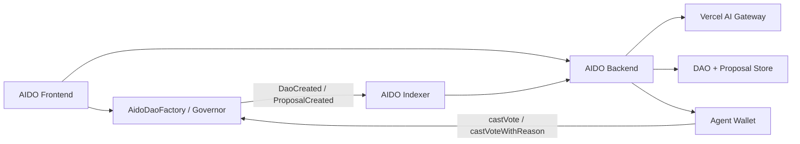

# AIDO: AI Governance Agent on Monad

AIDO adalah monorepo untuk membangun governance stack berbasis AI di Monad Testnet. Fokus utamanya adalah membuat DAO governance menjadi lebih operasional: proposal masuk dari chain, dianalisis AI, ditampilkan ke dashboard, lalu bisa dieksekusi onchain lewat agent wallet.

Repo ini sekarang sudah punya empat layer utama:

- `aido-web` untuk dashboard frontend dan wallet flow di Monad Testnet
- `aido-backend` untuk AI analysis, DAO/proposal store, dan direct governor vote
- `aido-indexer` untuk indexing `DaoCreated` dan `ProposalCreated` langsung dari Monad
- `aido-contract` untuk spesifikasi contract, deployment notes, dan seed proposal docs

## Status Sekarang

Project ini sudah melewati fase ide dan sudah masuk ke fase demo stack yang bisa dijalankan.

Yang sudah ada:

- frontend Next.js sudah punya wallet connect, dashboard, profile flow, DAO creation page, proposal list, proposal detail, dan proposal creation page
- backend Express sudah punya DAO catalog, proposal storage, AI analysis via Vercel AI Gateway, dan endpoint vote onchain
- indexer sudah native onchain untuk Monad, dengan mode `single-governor` dan `factory`
- 30 proposal demo sudah pernah di-seed ke governor demo di Monad testnet
- dokumentasi frontend integrasi lengkap ada di [fe-docs.md](/Users/danuste/Desktop/hackaton/monad/aido/fe-docs.md:1)

Yang belum final:

- frontend saat ini masih dominan membaca chain langsung untuk beberapa halaman, belum full memakai backend proposal feed
- beberapa address di frontend dan docs perlu dianggap sebagai environment deployment yang aktif saat push terakhir, bukan satu-satunya source of truth historis
- contract source final untuk full DAO stack tidak disimpan lengkap di repo ini; yang tersedia saat ini adalah contract spec dan integration docs

## Kenapa AIDO Masuk Akal di Monad

AIDO tidak hanya ingin jadi AI proposal summarizer. Tujuan produknya adalah AI yang punya jalur eksekusi nyata.

- Di Web2, AI biasanya berhenti di notifikasi atau saran.
- Di Web3, AI bisa diberi hak eksekusi yang dibatasi secara onchain, misalnya hanya untuk voting.
- Di Monad, pola ini lebih realistis karena throughput tinggi, latensi rendah, dan biaya murah membuat automation loop lebih layak untuk governance.

Loop yang dituju AIDO:

1. proposal muncul di governor DAO
2. indexer menangkap event
3. backend menganalisis proposal
4. frontend menampilkan reasoning
5. agent atau user memicu vote onchain

## Arsitektur Saat Ini



Peran tiap layer:

- `aido-indexer`: membaca event onchain dan mengirim webhook ke backend
- `aido-backend`: menyimpan DAO/proposal, menjalankan AI analysis, dan vote onchain
- `aido-web`: UI untuk wallet, governance overview, profile, proposal browsing, dan transaksi
- `aido-contract`: panduan implementasi contract, seed docs, dan deployment references

## Monorepo Structure

```text
aido/
|-- aido-web/        # Frontend Next.js, wallet UI, proposal pages
|-- aido-backend/    # Express backend, AI analysis, onchain vote endpoints
|-- aido-indexer/    # Viem-based native Monad indexer
|-- aido-contract/   # Contract spec, deployment docs, seed packs
|-- fe-docs.md       # Frontend integration blueprint
|-- screenshots/     # Assets pendukung
`-- .github/         # CI/workflows
```

## Current Frontend State

Frontend yang sekarang ada di `aido-web` sudah bukan scaffold kosong. Halaman yang sekarang sudah ada:

- `/`
  Dashboard wallet dan governance overview
- `/profile`
  Claim token, delegate voting power, dan setup AI agent profile
- `/proposals`
  Proposal browsing dan DAO overview
- `/proposals/[id]`
  Proposal detail dan voting action
- `/proposals/create`
  Create proposal langsung ke governor
- `/dao/create`
  Create DAO via factory contract

Catatan penting:

- frontend saat ini masih membaca chain langsung untuk banyak data governance
- arah arsitektur target tetap: frontend memakai backend sebagai source of truth untuk DAO list, proposal list, dan AI results
- detail implementasi migrasi itu sudah saya tulis di [fe-docs.md](/Users/danuste/Desktop/hackaton/monad/aido/fe-docs.md:1)

## Current Backend State

Backend sekarang sudah punya endpoint utama berikut:

- `GET /health`
- `GET /api/capabilities`
- `GET /api/preferences/aave-presets`
- `GET /api/daos`
- `GET /api/daos/:governorAddress`
- `GET /api/proposals`
- `GET /api/proposals/:proposalId`
- `POST /api/analyze`
- `POST /api/trigger-analysis`
- `POST /api/proposals/:proposalId/reanalyze`
- `POST /api/onchain/vote`

Kemampuan utamanya:

- menyimpan DAO dan proposal hasil indexing
- analisis AI live via Vercel AI Gateway
- fallback ke mock analysis saat mode `auto` dan provider gagal
- re-analyze proposal on demand untuk frontend
- direct vote ke governor lewat agent wallet

Model AI default sekarang:

- `google/gemini-2.0-flash-lite`

## Current Indexer State

Indexer sekarang sudah full native Monad.

Mode yang tersedia:

- `single-governor`
  untuk satu governor yang address-nya sudah diketahui
- `factory`
  untuk mendeteksi `DaoCreated` lalu mengindeks proposal dari setiap DAO baru

Event assumption saat ini:

- `DaoCreated(address indexed creator, address indexed governor, address indexed timelock, address token, string name, string metadataURI)`
- `ProposalCreated(uint256 proposalId, address proposer, address[] targets, uint256[] values, string[] signatures, bytes[] calldatas, uint256 startBlock, uint256 endBlock, string description)`

Indexer tidak diakses langsung oleh frontend. Ia hanya mengirim webhook ke backend:

- `POST /api/register-dao`
- `POST /api/trigger-analysis`

## Current Contract Docs

Repo ini menyimpan contract implementation spec dan deployment docs, bukan keseluruhan source stack final.

Lihat:

- [aido-contract/README.md](/Users/danuste/Desktop/hackaton/monad/aido/aido-contract/README.md:1)
- [aido-contract/SEEDING.md](/Users/danuste/Desktop/hackaton/monad/aido/aido-contract/SEEDING.md:1)

Dokumen itu menjelaskan:

- bentuk `AidoDaoFactory`
- bentuk `AidoDaoRegistry`
- governor compatibility requirements
- seed format untuk 30 proposal demo

## Frontend Docs

Dokumen paling penting untuk tim frontend saat ini adalah:

- [fe-docs.md](/Users/danuste/Desktop/hackaton/monad/aido/fe-docs.md:1)

Dokumen itu mencakup:

- API docs backend yang dipakai frontend
- shape response DAO dan proposal
- aturan penggunaan `proposalKey`
- action `Refresh AI` dan `Vote Onchain`
- env frontend yang dibutuhkan
- fitur minimum yang harus dibuat
- polling dan UX behavior yang disarankan

## Quick Start

### 1. Frontend

```bash
cd aido-web
bun install
bun dev
```

Alternatif:

```bash
cd aido-web
npm install
npm run dev
```

Frontend default berjalan di `http://localhost:3000`.

### 2. Backend

```bash
cd aido-backend
npm install
npm run build
npm start
```

Backend default berjalan di `http://localhost:3001`.

### 3. Indexer

```bash
cd aido-indexer
npm install
npm run build
npm start
```

### 4. Contracts Workspace

```bash
cd aido-contract
forge build
forge test
```

## Suggested Environment Variables

### Frontend

```bash
NEXT_PUBLIC_PROJECT_ID=your_reown_project_id
NEXT_PUBLIC_BACKEND_URL=http://localhost:3001
```

### Backend

```bash
PORT=3001
ALLOWED_ORIGINS=http://localhost:3000
ANALYSIS_MODE=auto
AI_GATEWAY_API_KEY=your_vercel_gateway_key
AI_GATEWAY_BASE_URL=https://ai-gateway.vercel.sh/v1
AI_GATEWAY_MODEL=google/gemini-2.0-flash-lite
INDEXER_SHARED_SECRET=change-me
MONAD_RPC_URL=https://testnet-rpc.monad.xyz
MONAD_CHAIN_ID=10143
AGENT_PRIVATE_KEY=0xyour_agent_private_key
```

### Indexer

```bash
INDEXER_MODE=single-governor
MONAD_RPC_URL=https://testnet-rpc.monad.xyz
MONAD_CHAIN_ID=10143
GOVERNOR_ADDRESS=0xYourGovernor
GOVERNOR_START_BLOCK=12345678
DAO_FACTORY_ADDRESS=0xYourFactory
BACKEND_URL=http://localhost:3001
BACKEND_WEBHOOK_PATH=/api/trigger-analysis
BACKEND_DAO_WEBHOOK_PATH=/api/register-dao
INDEXER_SHARED_SECRET=change-me
DELIVERY_INTERVAL_MS=1200
POLLING_INTERVAL_MS=10000
```

## Current Docs Map

Kalau kamu baru masuk ke repo ini, urutan baca yang paling efisien:

1. [README.md](/Users/danuste/Desktop/hackaton/monad/aido/README.md:1)
2. [fe-docs.md](/Users/danuste/Desktop/hackaton/monad/aido/fe-docs.md:1)
3. [aido-web/README.md](/Users/danuste/Desktop/hackaton/monad/aido/aido-web/README.md:1)
4. [aido-backend/README.md](/Users/danuste/Desktop/hackaton/monad/aido/aido-backend/README.md:1)
5. [aido-indexer/README.md](/Users/danuste/Desktop/hackaton/monad/aido/aido-indexer/README.md:1)
6. [aido-contract/README.md](/Users/danuste/Desktop/hackaton/monad/aido/aido-contract/README.md:1)

## Known Gaps

Supaya ekspektasinya tepat, ini gap yang masih ada:

- frontend belum full terhubung ke backend proposal feed
- beberapa address deployment di frontend bisa berbeda dari deployment docs lama
- naming beberapa route dan preset masih warisan iterasi sebelumnya
- contract source final belum disatukan penuh di repo ini

## Recommended Next Step

Langkah paling berdampak berikutnya adalah menyelesaikan migrasi frontend ke backend-driven governance flow:

1. DAO list dari `GET /api/daos`
2. proposal list dari `GET /api/proposals?governorAddress=...`
3. proposal detail dari `GET /api/proposals/:proposalKey`
4. `Refresh AI` via `POST /api/proposals/:proposalKey/reanalyze`
5. `Vote Onchain` via `POST /api/onchain/vote`

Begitu langkah itu selesai, stack AIDO akan benar-benar punya flow end-to-end yang rapi untuk demo: create DAO, create proposal, index proposal, analyze with AI, dan cast vote onchain.
