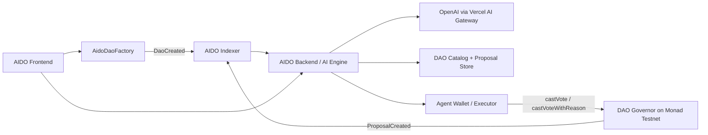

# AIDO (MonadVoter): AI-Powered Governance Agent for Monad

AIDO, dengan working title *MonadVoter*, adalah aplikasi *agent-native* di jaringan Monad yang mengotomatisasi tata kelola DAO. Dengan memanfaatkan kecepatan tinggi Monad, pengindeksan *real-time* Envio, serta analitik semantik berbasis Vercel AI SDK, AIDO membaca proposal, menyesuaikannya dengan profil risiko pengguna, lalu memberi rekomendasi atau mengeksekusi *vote* secara otonom.

Repositori ini disusun sebagai monorepo hackathon dan saat ini berisi fondasi untuk tiga lapisan utama:

- `aido-web` untuk frontend Next.js dan koneksi wallet ke Monad Testnet.
- `aido-contract` untuk smart contract berbasis Foundry.
- `aido-indexer` untuk watcher event proposal dari Monad Testnet.
- `aido-backend` untuk webhook ingestion, analisis AI, dan penyimpanan hasil reasoning.

## Project Status

Status saat ini adalah **prototype in progress**.

- Frontend wallet connection ke Monad Testnet sudah dikonfigurasi.
- Workspace contract sudah siap dengan Foundry, namun kontrak governance final belum diimplementasikan.
- Backend Express + Vercel AI SDK sudah bisa menerima DAO dan proposal onchain, menjalankan analisis AI atau mock analysis, dan mengeksekusi vote langsung ke governor.
- Indexer sekarang diarahkan ke arsitektur full onchain:
  - `single-governor` untuk satu governor address yang sudah diketahui.
  - `factory` untuk menangkap `DaoCreated` lalu mengindeks `ProposalCreated` dari setiap DAO baru.

Artinya, README ini menjelaskan **visi produk + arsitektur target + kondisi implementasi repo saat ini** agar tetap kuat untuk presentasi hackathon dan tetap jujur terhadap kode yang ada.

## Problem Statement

Governance DAO sering gagal karena tiga hal:

- Proposal terlalu panjang dan terlalu teknis bagi banyak pemegang token.
- Jendela voting terbatas, sehingga pengguna sering terlambat ikut serta.
- Delegasi ke manusia menciptakan bottleneck, bias, dan tidak selalu transparan.

AIDO mencoba menyelesaikan masalah tersebut dengan agen AI yang dapat:

- membaca proposal baru secara otomatis,
- meringkas isi proposal,
- menilai kecocokan dengan preferensi pengguna,
- menjelaskan alasan keputusan secara transparan,
- dan mengeksekusi vote on-chain jika pengguna mengaktifkan mode Auto-Pilot.

## Why Web3 and Monad?

Jika agen AI dapat dibangun di stack Web2, mengapa AIDO harus hidup di blockchain, dan mengapa Monad?

- **Execution, not just opinion.** Di Web2, AI biasanya berhenti di notifikasi atau saran. Di Web3, agen dapat benar-benar mengeksekusi tindakan melalui smart contract, misalnya memanggil `castVote`.
- **Trustless delegation.** Pengguna dapat mendelegasikan hak suara ke agen AI dengan batasan yang dapat diverifikasi secara kriptografis. Agen bisa dibatasi hanya untuk voting, tanpa kemampuan memindahkan dana pengguna.
- **Scalability that matches agent behavior.** Jika ratusan atau ribuan agen melakukan voting hampir bersamaan, blockchain yang lambat akan macet dan mahal. Monad dirancang untuk throughput tinggi dan eksekusi paralel, sehingga otomasi governance massal menjadi masuk akal secara ekonomi.
- **Low-latency automation loop.** Kombinasi *real-time indexing* + AI analysis + transaksi murah sangat penting untuk *time-sensitive governance*. Monad membuat loop ini jauh lebih layak untuk dieksekusi dalam kondisi nyata.
- **Composable governance identity.** Rekam jejak governance pengguna dapat menjadi primitive baru di ekosistem Web3. Dalam jangka panjang, partisipasi governance yang sehat dapat dipakai protokol lain untuk memberi insentif, reputasi, atau akses tertentu.

## Core Features

- AI merangkum proposal DAO dalam bahasa yang lebih mudah dipahami.
- AI memberi rekomendasi `FOR`, `AGAINST`, atau `ABSTAIN`.
- Rekomendasi diselaraskan dengan profil risiko pengguna.
- Pengguna bisa memilih mode manual atau Auto-Pilot.
- Setiap keputusan AI disertai *reasoning* yang dapat diaudit.
- Voting dapat dieksekusi on-chain melalui agen yang telah didelegasikan.
- Pengguna bisa membuat DAO baru di Monad testnet melalui factory contract, lalu langsung mengaktifkan AIDO untuk DAO tersebut.

## User-Created DAO Flow

Selain menganalisis proposal dari DAO yang sudah ada, AIDO juga bisa diperluas agar user membuat DAO sendiri.  
Flow yang paling masuk akal untuk hackathon adalah:

1. User membuka wizard “Create DAO”.
2. User mengisi nama DAO, token address, quorum, voting period, dan daftar proposer awal.
3. Frontend memanggil `DAO Factory` di Monad testnet.
4. Factory mendeploy satu paket DAO baru:
   - governor
   - timelock
   - registry metadata
5. Factory emit event `DaoCreated`.
6. Backend atau indexer menangkap event tersebut dan mendaftarkan DAO baru ke katalog AIDO.
7. Mulai saat itu proposal dari DAO buatan user bisa:
   - di-index,
   - dianalisis AI,
   - ditampilkan di dashboard,
   - dan di-auto-vote jika user mengaktifkan Auto-Pilot.

Keuntungan pendekatan ini:

- onboarding DAO baru jadi self-service,
- lebih kuat untuk demo karena seluruh lifecycle terjadi di Monad testnet,
- tidak tergantung pada platform governance eksternal,
- dan cocok untuk menunjukkan “AI governance infra”, bukan sekadar proposal reader.

## System Architecture

Arsitektur AIDO dirancang untuk berjalan secara asinkron dan *real-time*.



Komponen utama:

1. **Blockchain (Monad Testnet)**  
   Tempat `AidoDaoFactory`, `AidoDaoRegistry`, governor DAO, dan timelock berjalan.
2. **Indexer**  
   Mendengarkan `DaoCreated` dan `ProposalCreated` langsung dari Monad testnet.
3. **Backend and AI Engine (Next.js API + Vercel AI SDK)**  
   Mengambil teks proposal, menjalankan analisis AI, menghitung profil risiko, dan menyusun rekomendasi.
4. **Execution Layer (Agent Wallet)**  
   Mengirim transaksi `castVote` ke Monad Testnet ketika mode Auto-Pilot aktif.
5. **Frontend (Next.js + Tailwind CSS)**  
   Menjadi dashboard untuk wallet connection, pengaturan profil, dan audit trail keputusan AI.

## User Flow

1. Pengguna membuka dashboard dan menghubungkan wallet ke Monad Testnet.
2. Pengguna mengatur profil AI:
   - `Risk Tolerance`: Conservative / Neutral / Aggressive
   - `Ethical Focus`: Treasury Growth / Security / Decentralization
   - `Mode`: Manual atau Auto-Pilot
3. Pengguna melakukan delegasi voting ke smart contract atau agen yang dibatasi.
4. Saat proposal baru muncul, indexer menangkap event dari Governor.
5. Backend mengirim proposal ke model AI untuk diringkas dan dianalisis.
6. Dashboard menampilkan hasil berupa ringkasan, rekomendasi vote, skor risiko, dan alasan.
7. Jika Auto-Pilot aktif, agen mengeksekusi vote on-chain secara otomatis.

## Target Smart Contract Logic

Bagian ini adalah desain kontrak target untuk registry AIDO.  
**Catatan:** implementasi kontrak di repo saat ini masih berupa scaffold Foundry (`Counter.sol`), jadi snippet di bawah adalah referensi arah produk, bukan isi file yang sudah live.

**`contracts/MonadVoterRegistry.sol`**

```solidity
// SPDX-License-Identifier: MIT
pragma solidity ^0.8.20;

contract MonadVoterRegistry {
    enum RiskProfile { CONSERVATIVE, NEUTRAL, AGGRESSIVE }

    struct UserConfig {
        RiskProfile riskProfile;
        bool isAutoPilot;
        address delegatedAgent; // executor bot address
    }

    mapping(address => UserConfig) public userConfigs;

    event ConfigUpdated(address indexed user, RiskProfile risk, bool autoPilot, address agent);
    event VoteExecutedByAgent(address indexed user, uint256 proposalId, uint8 support);

    function setConfig(RiskProfile _risk, bool _autoPilot, address _agent) external {
        userConfigs[msg.sender] = UserConfig(_risk, _autoPilot, _agent);
        emit ConfigUpdated(msg.sender, _risk, _autoPilot, _agent);
    }

    function recordAgentVote(address _user, uint256 _proposalId, uint8 _support) external {
        require(msg.sender == userConfigs[_user].delegatedAgent, "Not authorized agent");
        require(userConfigs[_user].isAutoPilot, "Auto-pilot disabled");

        // Place DAO interaction logic here
        // IGovernor(daoAddress).castVoteWithReason(...)

        emit VoteExecutedByAgent(_user, _proposalId, _support);
    }
}
```

## Target Indexer Design (Envio)

Indexer bertugas memantau proposal baru tanpa perlu *polling* berat ke RPC.

**`config.yaml`**

```yaml
name: MonadVoter-Indexer
description: Indexing DAO proposals on Monad Testnet
networks:
  - id: 10143
    rpc_config:
      url: https://testnet-rpc.monad.xyz
    contracts:
      - name: Governor
        address:
          - 0xYourDaoGovernorAddress
        handler: src/EventHandlers.ts
        events:
          - event: ProposalCreated(uint256 proposalId, address proposer, address[] targets, uint256[] values, string[] signatures, bytes[] calldatas, uint256 startBlock, uint256 endBlock, string description)
```

**`src/EventHandlers.ts`**

```ts
import { Governor } from "generated";

Governor.ProposalCreated.handler(async ({ event, context }) => {
  const proposalId = event.params.proposalId.toString();

  context.Proposal.set({
    id: proposalId,
    proposer: event.params.proposer,
    description: event.params.description,
    status: "Active",
  });

  await fetch("https://your-domain.com/api/trigger-analysis", {
    method: "POST",
    headers: { "Content-Type": "application/json" },
    body: JSON.stringify({
      proposalId,
      description: event.params.description,
    }),
  });
});
```

## Target Backend Design (Next.js + Vercel AI SDK)

Backend menjadi otak agen: menerima proposal, menjalankan reasoning, dan menghasilkan keputusan terstruktur.

**`app/api/analyze/route.ts`**

```ts
import { generateObject } from "ai";
import { createOpenAI } from "@ai-sdk/openai";
import { z } from "zod";
import { NextResponse } from "next/server";

const openai = createOpenAI({
  baseURL:
    "https://gateway.ai.vercel.pub/v1/projects/YOUR_PROJECT_ID/gateways/monad-gateway",
  apiKey: process.env.OPENAI_API_KEY,
});

export async function POST(req: Request) {
  const { proposalText, userRiskProfile } = await req.json();

  try {
    const { object } = await generateObject({
      model: openai("gpt-4o"),
      schema: z.object({
        summary: z.string().describe("Ringkasan proposal maksimal 3 kalimat."),
        recommendedVote: z
          .enum(["FOR", "AGAINST", "ABSTAIN"])
          .describe("Rekomendasi vote."),
        reasoning: z
          .string()
          .describe("Alasan merekomendasikan pilihan tersebut."),
        riskScore: z.number().describe("Skor risiko dari 1 hingga 100."),
      }),
      system: `Kamu adalah agen tata kelola DAO untuk jaringan Monad.
Analisis proposal berdasarkan profil pengguna: ${userRiskProfile}.`,
      prompt: `Teks Proposal DAO: ${proposalText}`,
    });

    return NextResponse.json(object);
  } catch (error) {
    return NextResponse.json(
      { error: "Gagal menganalisis proposal" },
      { status: 500 }
    );
  }
}
```

## Target Frontend Experience

Frontend menjadi tempat pengguna:

- menghubungkan wallet,
- mengatur profil governance,
- melihat proposal aktif,
- membaca *reasoning* AI,
- dan menjalankan atau memverifikasi keputusan on-chain.

Contoh UI dashboard:

**`app/page.tsx`**

```tsx
"use client";

import { useState } from "react";

export default function Dashboard() {
  const [proposal, setProposal] = useState(
    "Transfer 50,000 MON ke marketing wallet."
  );
  const [analysis, setAnalysis] = useState<any>(null);
  const [loading, setLoading] = useState(false);

  const handleAnalyze = async () => {
    setLoading(true);
    const res = await fetch("/api/analyze", {
      method: "POST",
      headers: { "Content-Type": "application/json" },
      body: JSON.stringify({
        proposalText: proposal,
        userRiskProfile: "CONSERVATIVE",
      }),
    });
    const data = await res.json();
    setAnalysis(data);
    setLoading(false);
  };

  return (
    <div className="min-h-screen bg-slate-50 p-8 text-slate-900">
      <div className="mx-auto max-w-4xl">
        <header className="mb-8 flex items-center justify-between">
          <h1 className="text-3xl font-bold text-blue-600">MonadVoter AI</h1>
          <button className="rounded-lg bg-blue-600 px-4 py-2 text-white">
            Connect Wallet
          </button>
        </header>

        <div className="rounded-xl border border-slate-200 bg-white p-6 shadow">
          <h2 className="mb-2 text-xl font-semibold">Proposal Aktif #102</h2>
          <p className="mb-4 text-slate-600">{proposal}</p>

          <button
            onClick={handleAnalyze}
            disabled={loading}
            className="mb-6 rounded-md bg-slate-900 px-4 py-2 text-white disabled:opacity-50"
          >
            {loading ? "Agent Thinking..." : "Ask Agent to Analyze"}
          </button>

          {analysis && (
            <div className="rounded-r-md border-l-4 border-blue-500 bg-blue-50 p-4">
              <div className="mb-2 flex items-start justify-between">
                <h3 className="font-bold text-blue-900">Agent Reasoning</h3>
                <span
                  className={`rounded px-2 py-1 text-sm font-bold ${
                    analysis.recommendedVote === "FOR"
                      ? "bg-green-200 text-green-800"
                      : analysis.recommendedVote === "AGAINST"
                        ? "bg-red-200 text-red-800"
                        : "bg-gray-200 text-gray-800"
                  }`}
                >
                  RECOMMENDS: {analysis.recommendedVote}
                </span>
              </div>
              <p className="mb-2 text-sm text-blue-800">
                <strong>Summary:</strong> {analysis.summary}
              </p>
              <p className="mb-2 text-sm text-blue-800">
                <strong>Why:</strong> {analysis.reasoning}
              </p>
              <button className="mt-4 w-full rounded-md bg-blue-600 py-2 text-white hover:bg-blue-700">
                Execute On-chain Vote
              </button>
            </div>
          )}
        </div>
      </div>
    </div>
  );
}
```

## Monorepo Structure

```text
aido/
|-- aido-web/        # Next.js frontend, wallet connect, dashboard scaffold
|-- aido-contract/   # Foundry workspace for smart contracts
|-- aido-indexer/    # Viem-based proposal event watcher for Monad
|-- aido-backend/    # Express backend for AI analysis and proposal storage
|-- screenshots/     # Supporting assets
`-- .github/         # CI workflow
```

## Current Implementation Notes

Beberapa hal yang sudah benar-benar ada di repo saat ini:

- `aido-web` sudah mengonfigurasi Monad Testnet dengan chain ID `10143`.
- `aido-web` sudah memakai Reown AppKit, Wagmi, React Query, Next.js 16, dan Tailwind CSS.
- `aido-web/src/components/navbar.tsx` sudah menampilkan tombol wallet `<appkit-button />`.
- `aido-contract` sudah memiliki workspace Foundry lengkap dengan CI GitHub Actions untuk `forge fmt`, `forge build`, dan `forge test`.
- `aido-backend` sudah menyediakan endpoint `GET /health`, `POST /api/analyze`, `POST /api/trigger-analysis`, dan penyimpanan hasil analisis berbasis file JSON.
- `aido-indexer` sudah menyediakan mode `single-governor` dan `factory` untuk indexing DAO native di Monad.

Beberapa hal yang masih *to-do*:

- kontrak registry khusus governance,
- service agent execution,
- alamat `DAO_FACTORY_ADDRESS` dan governor template final,
- ABI final jika event factory atau governor berbeda dari asumsi saat ini,
- integrasi frontend ke backend proposal feed,
- migrasi ke Envio jika ingin hosted indexing dan GraphQL layer,
- dashboard UI final untuk proposal dan reasoning log.

## Tech Stack

- **Chain:** Monad Testnet
- **Frontend:** Next.js, React, Tailwind CSS, Reown AppKit, Wagmi, Viem
- **Smart Contracts:** Solidity, Foundry
- **Indexer (current):** Viem-based onchain event watcher
- **Indexer (target):** Envio
- **Backend (current):** Express.js
- **AI Layer:** Vercel AI SDK + OpenAI
- **Execution Layer:** Agent wallet / delegated executor

## Local Development

### 1. Frontend

Masuk ke frontend dan jalankan server development:

```bash
cd aido-web
bun install
bun dev
```

Alternatif jika tidak memakai Bun:

```bash
cd aido-web
npm install
npm run dev
```

Frontend akan berjalan di `http://localhost:3000`.

### 2. Smart Contracts

Masuk ke workspace Foundry:

```bash
cd aido-contract
forge build
forge test
```

### 3. Backend and Indexer

Jalankan backend:

```bash
cd aido-backend
npm install
npm run dev
```

Jalankan indexer:

```bash
cd aido-indexer
npm install
npm run dev
```

Catatan:

- Backend default berjalan di `http://localhost:3001`.
- Jika `INDEXER_MODE=single-governor`, indexer membutuhkan `GOVERNOR_ADDRESS`.
- Jika `INDEXER_MODE=factory`, indexer membutuhkan `DAO_FACTORY_ADDRESS`.
- Tanpa `OPENAI_API_KEY`, backend tetap berjalan dengan mode analisis mock saat `ANALYSIS_MODE=auto`.

## Suggested Environment Variables

Untuk pengembangan penuh, variabel berikut direkomendasikan:

```bash
# frontend
NEXT_PUBLIC_PROJECT_ID=your_reown_project_id

# backend / ai
ANALYSIS_MODE=auto
OPENAI_API_KEY=your_openai_api_key
OPENAI_BASE_URL=https://gateway.ai.vercel.pub/v1/projects/YOUR_PROJECT_ID/gateways/monad-gateway
OPENAI_MODEL=gpt-4.1
INDEXER_SHARED_SECRET=change-me

# blockchain
MONAD_RPC_URL=https://testnet-rpc.monad.xyz
INDEXER_MODE=factory
MONAD_CHAIN_ID=10143
GOVERNOR_ADDRESS=0xYourDaoGovernorAddress
GOVERNOR_START_BLOCK=1234567
DAO_FACTORY_ADDRESS=0xYourDaoFactoryAddress
FACTORY_START_BLOCK=1234500
BACKEND_DAO_WEBHOOK_PATH=/api/register-dao
AGENT_PRIVATE_KEY=0xyouragentprivatekey

# service wiring
BACKEND_URL=http://localhost:3001
```

## Why This Project Can Win a Hackathon

AIDO punya proposisi yang kuat untuk penjurian karena menggabungkan tiga lapisan yang biasanya berdiri sendiri:

- **AI with real action.** AI tidak hanya memberi insight, tetapi bisa mengeksekusi aksi governance secara langsung.
- **Monad-native advantage.** Value proposition-nya menjadi lebih kuat justru karena Monad unggul di throughput dan biaya rendah.
- **Human-AI collaboration.** Pengguna tetap memegang kontrol melalui mode manual, profil risiko, dan audit trail reasoning.
- **Clear real-world use case.** DAO governance adalah masalah nyata, bukan sekadar demo AI generik yang ditempel ke blockchain.

## Roadmap

1. Mengganti `Counter.sol` dengan kontrak registry governance yang sesungguhnya.
2. Menambahkan API analisis proposal berbasis Vercel AI SDK.
3. Menyusun indexer Envio untuk event `ProposalCreated`.
4. Menyimpan histori keputusan AI dan status eksekusi vote.
5. Menambahkan dashboard proposal aktif, reasoning panel, dan Auto-Pilot controls.
6. Menyiapkan demo end-to-end dari proposal masuk sampai vote tercatat on-chain.

## Conclusion

AIDO adalah tesis bahwa governance DAO bisa dibuat lebih cepat, lebih cerdas, dan lebih partisipatif dengan agen AI yang dieksekusi di atas infrastruktur Monad. Kombinasi AI reasoning, delegasi yang dibatasi secara on-chain, dan eksekusi murah berkecepatan tinggi membuka bentuk baru *autonomous governance* yang sulit dicapai di stack Web2 maupun blockchain yang lebih lambat.

Jika kamu ingin melanjutkan repo ini setelah README, langkah paling natural berikutnya adalah:

1. scaffold kontrak `MonadVoterRegistry`,
2. scaffold route `aido-web/src/app/api/analyze/route.ts`,
3. ubah homepage `aido-web/src/app/page.tsx` menjadi dashboard governance yang sesungguhnya.
