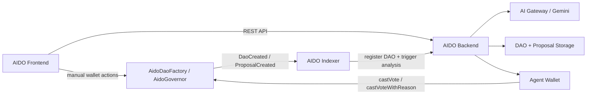

# AIDO

AI governance agent infrastructure for DAOs on Monad Testnet.

AIDO is a monorepo for building an end-to-end governance stack on Monad: DAO creation, native onchain proposal indexing, AI proposal analysis, and onchain voting through either a connected wallet or an agent-assisted backend flow.

Category: `AI x DAO Governance`

Short description:
`AIDO is an AI-powered governance agent on Monad that helps users create DAOs, index native onchain proposals, analyze them with live AI, and vote through either manual wallet execution or an agent-assisted flow.`

The project is designed for a simple but powerful loop:

1. A DAO exists on Monad Testnet.
2. The governor emits proposal events onchain.
3. The indexer captures those events.
4. The backend stores proposals and generates AI reasoning.
5. The frontend lets users review, understand, and vote on proposals.

## The Problem

DAO governance is important, but in practice it is often difficult to follow and even harder to act on.

Common problems:

- proposals are time-consuming to read
- governance interfaces often stop at raw data and timelines
- many token holders do not participate consistently
- governance execution is fragmented across dashboards, wallets, and explorers
- AI tools can summarize content, but they usually do not connect to real onchain execution

This creates a gap between:

- discovering a proposal
- understanding what it means
- deciding what to do
- actually casting the vote onchain

## The Solution

AIDO turns governance into an AI-assisted operational workflow.

Instead of treating governance as a static dashboard, AIDO treats it as a loop:

- detect new proposal activity onchain
- store and structure proposal data
- run AI analysis on the proposal
- show recommendation and reasoning in a usable interface
- let the user or agent execute the decision onchain

This makes governance more understandable for users and more actionable for DAOs.

## What AIDO Does

AIDO is not just a proposal dashboard and not just an AI summarizer.

It combines:

- native Monad DAO contracts
- a proposal indexer
- a backend AI analysis layer
- a wallet-based governance frontend
- an optional agent execution path for onchain voting

The goal is to make governance more operational:

- easier to understand
- easier to monitor
- faster to act on
- fully grounded in real onchain state

## Why This Makes Sense on Monad

AI governance becomes more useful when it has an execution path, not just a commentary layer.

On Web2, AI usually stops at alerts, summaries, or recommendations. Onchain, an AI-driven governance system can participate in real execution flows with strict contract boundaries.

Monad is a strong fit for this pattern because:

- low-cost transactions make governance interactions practical
- fast execution reduces friction for repeated proposal activity
- native onchain state is available for indexing and automation
- DAO workflows feel usable in real time instead of purely conceptual

## Why AIDO Is Interesting

The project is interesting for three reasons:

### 1. AI With Execution

Most AI governance products stop at summaries or notifications.

AIDO goes one step further:

- AI produces reasoning
- the interface helps users decide
- the system supports real onchain voting

### 2. Native Onchain Governance, Not a Mock Feed

The current architecture indexes DAO proposals from Monad-native contracts rather than from an external governance mirror.

That means the system is grounded in:

- real governor state
- real proposal IDs
- real proposal deadlines
- real voting transactions

### 3. Human and Agent Modes Can Coexist

AIDO does not force a single model of control.

It supports a spectrum:

- AI explain only
- AI-assisted manual voting
- agent-assisted vote execution

That makes it useful both as a governance copilot and as a foundation for future autonomous governance flows.

## Core Use Cases

### 1. Create a DAO on Monad Testnet

Users can create a DAO from the frontend through the DAO factory flow. The resulting governor can then be indexed and surfaced across the stack.

### 2. Browse Native Onchain Proposals

The stack indexes `ProposalCreated` events directly from Monad instead of relying on offchain governance sources.

### 3. Use AI as a Governance Copilot

Users can ask the system to analyze a proposal and return:

- a short summary
- a vote recommendation
- reasoning
- a risk score
- an alignment score

### 4. Vote Manually from the User Wallet

The frontend can call the governor directly from the connected wallet so the user remains the final decision-maker.

### 5. Use Agent-Assisted Voting

The backend can submit onchain votes through an agent wallet for supported flows. This is useful for demos, assisted execution, and future automation paths.

## User Journeys

### Journey 1: A DAO Creator

1. A user creates a DAO from the frontend.
2. The factory deploys or registers the DAO on Monad Testnet.
3. The indexer detects the DAO.
4. The backend stores it.
5. The frontend shows the DAO in the governance catalog.

### Journey 2: A Governance Participant

1. A user opens a DAO.
2. The user sees a list of active and historical proposals.
3. The user opens a proposal detail page.
4. The AI agent provides summary, recommendation, and reasoning.
5. The user votes directly from their connected wallet.

### Journey 3: An AI-Assisted Operator

1. A proposal is indexed into the backend.
2. The backend analyzes the proposal automatically.
3. The user reviews the recommendation.
4. The user triggers an agent-assisted vote flow.
5. The backend sends a real transaction to the governor.

## Product Modes

AIDO currently supports or is designed around three governance modes:

- `Explain only`
  AI summarizes and explains proposals, but the user does not vote through the system.
- `Assist + manual vote`
  AI provides analysis, and the user votes directly from their wallet.
- `Agent-assisted execution`
  AI provides analysis and the backend agent can submit the vote onchain through the backend flow.

## Architecture



### Layer Responsibilities

- `aido-web`
  Frontend dashboard, wallet flow, proposal pages, DAO creation flow, and user-facing governance UX.
- `aido-backend`
  DAO catalog, proposal storage, AI analysis, proposal reanalysis, and backend-driven vote execution.
- `aido-indexer`
  Native Monad indexer that watches DAO and proposal events and delivers them to the backend.
- `aido-contract`
  Contract specifications, deployment notes, frontend contract docs, and seed proposal packs.

## Technical Design Principles

The stack is built around a few design decisions:

- `Onchain-first`
  Proposal and vote state should come from Monad contracts, not from a parallel offchain data model.
- `Backend as integration layer`
  The backend is responsible for AI reasoning, proposal storage, and execution APIs.
- `Frontend as governance surface`
  The frontend should be the main place where users read, understand, and act on governance.
- `AI as copilot before autopilot`
  The system should be useful even when users still want full manual control.
- `Composable deployment`
  Frontend, backend, indexer, and contracts can evolve independently while still fitting the same architecture.

## Repository Structure

```text
aido/
|-- aido-web/        # Next.js frontend
|-- aido-backend/    # Express backend + AI + onchain vote execution
|-- aido-indexer/    # Native Monad indexer
|-- aido-contract/   # Contract specs, deployment docs, seed packs
|-- fe-docs.md       # Frontend integration guide
|-- ppt-docs.md      # Demo and slide deck guide
|-- screenshots/     # Supporting assets
`-- .github/         # GitHub workflows and repo automation
```

## Live Deployment

### Public URLs

- Frontend: deployed separately by the frontend team
- Backend API: [aido-api.staifdev.codes](https://aido-api.staifdev.codes)
- Backend health: [aido-api.staifdev.codes/health](https://aido-api.staifdev.codes/health)
- Indexer status endpoint: [aido-indexer.staifdev.codes](https://aido-indexer.staifdev.codes)

### Important Notes

- `aido-indexer.staifdev.codes` is a service status endpoint, not a GraphQL explorer.
- The backend is the primary API surface for frontend integration.
- CORS is currently configured to allow all origins via `ALLOWED_ORIGINS=*`.

## Demo Scenario

The live demo story for AIDO is straightforward:

1. Open the frontend and connect a wallet on Monad Testnet.
2. Open the demo DAO.
3. Browse proposals that were seeded directly to the live governor.
4. Open a proposal detail page.
5. Show the AI recommendation and reasoning.
6. Vote from the connected wallet or trigger the backend vote flow.
7. Verify the result onchain.

This lets the product be demonstrated as a real governance tool instead of a static mockup.

## Current Monad Testnet Contracts

### Core Contracts

| Contract | Address |
| --- | --- |
| `AIDO_TOKEN` | `0x8a2CF47167EBC346d88B29c69d6C384945B3f63f` |
| `AIDO_GOVERNOR` | `0x5D5d646a5Fdc86f578aCB9cC8f42C91b0C7b647B` |
| `MONAD_VOTER_REGISTRY` | `0x0F3752932c00F7cD471F183b419684D5BbdEA492` |
| `AIDO_DAO_FACTORY` | `0x19DfE2f666106E9eA84508FC37FA9725D2A187b6` |
| `AIDO_DAO_REGISTRY` | `0xae4Ba05f50DD3080722fea59c8C9CBD4FE22127d` |
| `TIMELOCK` | `0xff512B03fCF978cD183d0635c4Be9FFd9e0647A9` |

### Seed Target Modules

| Module | Address |
| --- | --- |
| `TREASURY_MODULE` | `0x265Def4579Db17D375042426FDa1f674114AEe23` |
| `RISK_MODULE` | `0x1dF4c3b00cCe33c3Da83473F87B692CCDB932b4a` |
| `GOVERNANCE_MODULE` | `0x14938CFa2713f34486aDC28ec9D999f11d1F427A` |
| `OPERATIONS_MODULE` | `0xff3dea86623abd0827157FA80598d2205C1bF117` |
| `EMISSIONS_MODULE` | `0xD6d601a326292C9C118cE452d8668e5ca08B9994` |
| `GROWTH_MODULE` | `0x52526bFE8BCf86F87a388099737676e5171F8142` |
| `PARTNERSHIPS_MODULE` | `0x5586bf0FBBfC3BB0347ebef0EDdD60809a29739A` |

## What Is Live Today

The project is already beyond the idea stage and has a working demo stack.

Currently available:

- frontend with wallet connection and governance pages
- backend with proposal storage and AI analysis
- native indexer connected to Monad Testnet
- public backend and indexer deployment
- seeded proposals on the live demo governor
- live AI analysis through Vercel AI Gateway
- onchain vote execution flow through the governor

## Submission-Ready Highlights

If this repository is being reviewed in a hackathon or demo setting, the most important things to know are:

- AIDO is live on Monad Testnet
- the contracts are real and publicly deployed
- the proposal feed is native to Monad
- AI analysis is running live
- the backend is publicly reachable
- voting is wired to the live governor

In other words, the project is not only presenting a concept. It demonstrates the full path from governance data to governance action.

## Current Frontend Status

The frontend in `aido-web` is no longer a stub. It already includes:

- `/`
  governance dashboard and wallet overview
- `/profile`
  claim, delegation, and AI profile flow
- `/proposals`
  proposal browsing
- `/proposals/[id]`
  proposal detail and wallet voting
- `/proposals/create`
  create proposal flow
- `/dao/create`
  create DAO flow

### Frontend Notes

- some pages still read chain data directly
- the target architecture is backend-driven for proposal feed and AI results
- manual wallet voting already exists in the proposal detail page
- AI analysis UI still needs full backend wiring on some frontend paths

## Current Backend Status

The backend already supports:

- DAO catalog storage
- proposal ingestion from the indexer
- AI proposal analysis
- live reanalysis for frontend refresh flows
- direct onchain vote execution to the governor

### Main Endpoints

- `GET /health`
- `GET /api/capabilities`
- `GET /api/preferences/aave-presets`
- `GET /api/daos`
- `GET /api/daos/:governorAddress`
- `GET /api/proposals`
- `GET /api/proposals/:proposalId`
- `POST /api/analyze`
- `POST /api/trigger-analysis`
- `POST /api/proposals/:proposalId/reanalyze`
- `POST /api/onchain/vote`

### AI Defaults

- provider path: Vercel AI Gateway
- current live model: `google/gemini-2.0-flash-lite`
- fallback mode: mock analysis when live AI is unavailable

## Current Indexer Status

The indexer is fully native to Monad and no longer depends on external governance platforms.

### Supported Modes

- `single-governor`
  for indexing one known governor
- `factory`
  for listening to DAO creation and indexing newly created DAOs

### Event Assumptions

- `DaoCreated(address indexed creator, address indexed governor, address indexed timelock, address token, string name, string metadataURI)`
- `ProposalCreated(uint256 proposalId, address proposer, address[] targets, uint256[] values, string[] signatures, bytes[] calldatas, uint256 startBlock, uint256 endBlock, string description)`

The indexer does not serve frontend traffic directly. Its job is to deliver DAO and proposal events to the backend.

## End-to-End Flow

### DAO Creation Flow

1. A user creates a DAO from the frontend.
2. The factory emits `DaoCreated`.
3. The indexer captures the event.
4. The backend stores the DAO in its catalog.
5. The frontend can fetch the DAO from the backend.

### Proposal Analysis Flow

1. A proposal is created on the governor.
2. The indexer captures `ProposalCreated`.
3. The backend stores the proposal.
4. The backend generates AI analysis.
5. The frontend displays summary, recommendation, and reasoning.

### Manual Vote Flow

1. The user opens a proposal page.
2. The frontend reads proposal state from the governor.
3. If the proposal is active, the user can vote from the connected wallet.
4. The vote is submitted directly onchain.

### Agent-Assisted Vote Flow

1. The frontend or API triggers a backend vote request.
2. The backend validates the target proposal.
3. The agent wallet submits `castVote` or `castVoteWithReason`.
4. The vote is written onchain and recorded in backend storage.

## Manual vs Agent Voting

Both models matter in AIDO:

### Manual Wallet Vote

- the connected wallet sends the transaction
- the user is the final decision-maker
- the frontend reads live state directly from the governor

### Agent-Assisted Vote

- the backend agent sends the transaction
- the backend can attach reasoning and execution records
- the model is useful for assisted execution and future automation

This distinction is important because AIDO is intentionally built to support both trust-minimized user control and agent-driven operational flows.

## Local Development

### Frontend

```bash
cd aido-web
bun install
bun dev
```

or

```bash
cd aido-web
npm install
npm run dev
```

Default local URL: `http://localhost:3000`

### Backend

```bash
cd aido-backend
npm install
npm run build
npm start
```

Default local URL: `http://localhost:3001`

### Indexer

```bash
cd aido-indexer
npm install
npm run build
npm start
```

### Contracts Workspace

```bash
cd aido-contract
forge build
forge test
```

## Environment Variables

### Frontend

```bash
NEXT_PUBLIC_PROJECT_ID=your_reown_project_id
NEXT_PUBLIC_BACKEND_URL=http://localhost:3001
```

### Backend

```bash
PORT=3001
ALLOWED_ORIGINS=*
ANALYSIS_MODE=auto
AI_GATEWAY_API_KEY=your_vercel_gateway_key
AI_GATEWAY_BASE_URL=https://ai-gateway.vercel.sh/v1
AI_GATEWAY_MODEL=google/gemini-2.0-flash-lite
OPENAI_API_KEY=
OPENAI_BASE_URL=
OPENAI_MODEL=gpt-4.1
INDEXER_SHARED_SECRET=change-me
MONAD_RPC_URL=https://testnet-rpc.monad.xyz
MONAD_CHAIN_ID=10143
AGENT_PRIVATE_KEY=0xyour_agent_private_key
DEFAULT_VOTING_PERIOD_SECONDS=86400
DEFAULT_RISK_PROFILE=NEUTRAL
DEFAULT_ETHICAL_FOCUS=DECENTRALIZATION
DATA_FILE=data/proposals.json
```

### Indexer

```bash
INDEXER_MODE=single-governor
MONAD_RPC_URL=https://testnet-rpc.monad.xyz
MONAD_CHAIN_ID=10143
GOVERNOR_ADDRESS=0xYourGovernor
GOVERNOR_START_BLOCK=12345678
DAO_FACTORY_ADDRESS=0xYourFactory
BACKEND_URL=http://localhost:3001
BACKEND_WEBHOOK_PATH=/api/trigger-analysis
BACKEND_DAO_WEBHOOK_PATH=/api/register-dao
INDEXER_SHARED_SECRET=change-me
DELIVERY_INTERVAL_MS=1200
POLLING_INTERVAL_MS=10000
```

## Seed Data

The repository includes proposal seed packs for demo use.

Useful files:

- [aido-contract/seeds/monad-testnet-30-proposals.json](/Users/danuste/Desktop/hackaton/monad/aido/aido-contract/seeds/monad-testnet-30-proposals.json:1)
- [aido-contract/seeds/monad-testnet-5-replacement-proposals.json](/Users/danuste/Desktop/hackaton/monad/aido/aido-contract/seeds/monad-testnet-5-replacement-proposals.json:1)
- [aido-contract/SEEDING.md](/Users/danuste/Desktop/hackaton/monad/aido/aido-contract/SEEDING.md:1)

These packs are designed for governor-style proposal submission on Monad Testnet.

## Documents You Should Read Next

Depending on your goal:

- if you are working on the frontend, start with [fe-docs.md](/Users/danuste/Desktop/hackaton/monad/aido/fe-docs.md:1)
- if you are working on backend APIs, read [aido-backend/README.md](/Users/danuste/Desktop/hackaton/monad/aido/aido-backend/README.md:1)
- if you are working on indexing, read [aido-indexer/README.md](/Users/danuste/Desktop/hackaton/monad/aido/aido-indexer/README.md:1)
- if you are implementing or reviewing contracts, read [aido-contract/README.md](/Users/danuste/Desktop/hackaton/monad/aido/aido-contract/README.md:1)
- if you are preparing the demo deck, use the slide and demo notes already captured in the repo docs and submission materials

## Documentation Map

If you are new to the repo, this is the best reading order:

1. [README.md](/Users/danuste/Desktop/hackaton/monad/aido/README.md:1)
2. [fe-docs.md](/Users/danuste/Desktop/hackaton/monad/aido/fe-docs.md:1)
3. [aido-web/README.md](/Users/danuste/Desktop/hackaton/monad/aido/aido-web/README.md:1)
4. [aido-backend/README.md](/Users/danuste/Desktop/hackaton/monad/aido/aido-backend/README.md:1)
5. [aido-indexer/README.md](/Users/danuste/Desktop/hackaton/monad/aido/aido-indexer/README.md:1)
6. [aido-contract/README.md](/Users/danuste/Desktop/hackaton/monad/aido/aido-contract/README.md:1)
7. [ppt-docs.md](/Users/danuste/Desktop/hackaton/monad/aido/ppt-docs.md:1)

## Known Limitations

To keep expectations realistic, these are the main gaps today:

- some frontend screens still need full backend integration
- the backend proposal feed and the frontend direct-onchain reads can temporarily diverge if proposal state changes quickly
- the live governor currently uses a very short voting period, so proposals can move from active to closed quickly
- the final full Solidity source stack is not completely centralized in this repo; this repo currently stores the contract specs and integration docs

## Recommended Next Step

The highest-impact next step is to finish the frontend migration to a backend-driven governance flow:

1. DAO list from `GET /api/daos`
2. proposal list from `GET /api/proposals?governorAddress=...`
3. proposal detail from `GET /api/proposals/:proposalKey`
4. AI refresh from `POST /api/proposals/:proposalKey/reanalyze`
5. agent execution from `POST /api/onchain/vote`

Once that migration is complete, AIDO will have a cleaner end-to-end demo path:

- create DAO
- create proposal
- index proposal
- analyze with AI
- vote onchain

## Summary

AIDO is an AI governance agent stack for Monad that connects:

- DAO creation
- proposal indexing
- AI reasoning
- human decision-making
- onchain vote execution

It is designed to show that AI in governance is most compelling when it is not isolated from execution. On Monad, that idea becomes practical enough to demo as a real product.
